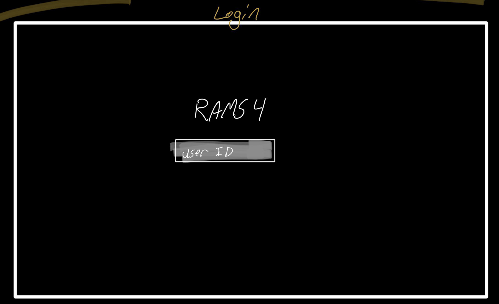
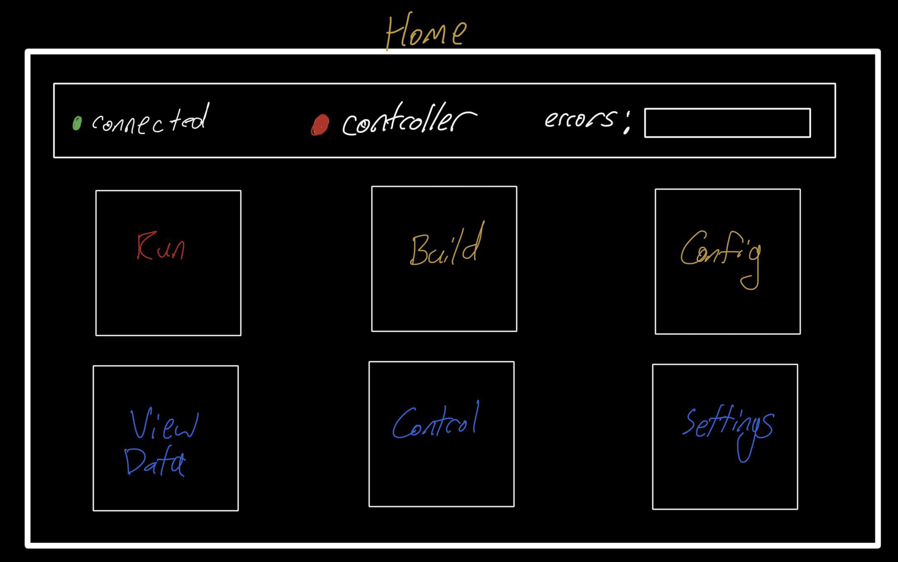
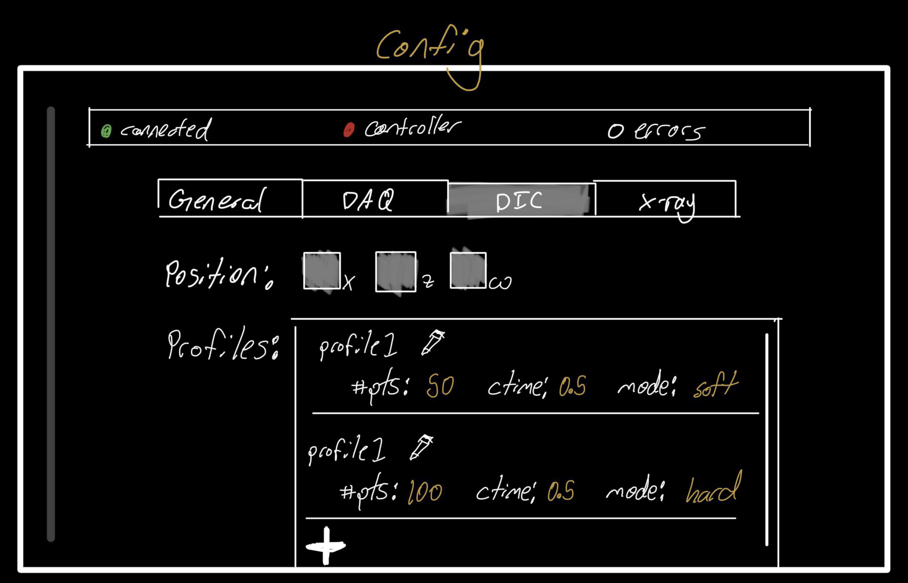
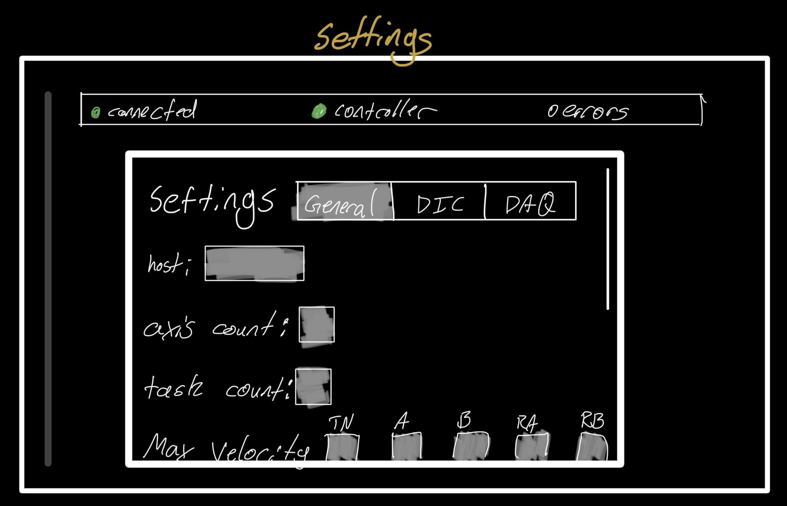
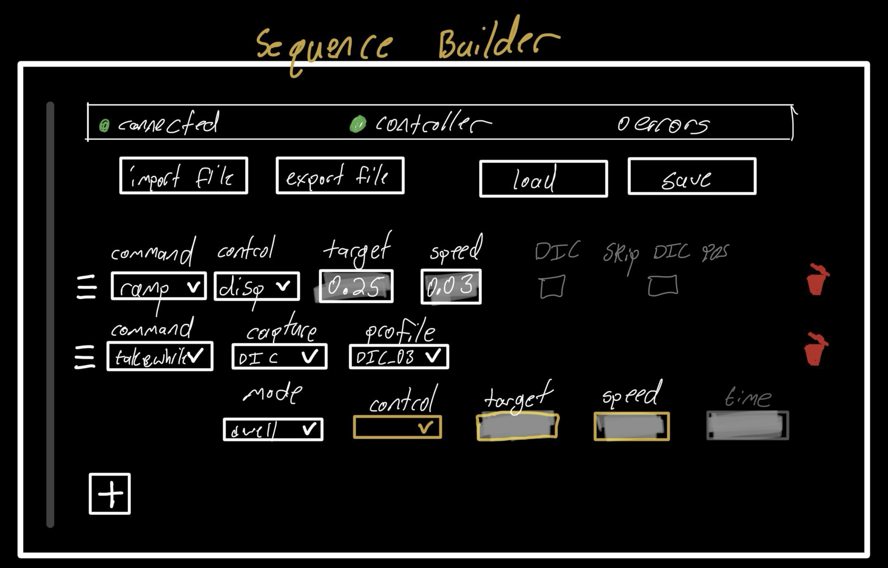
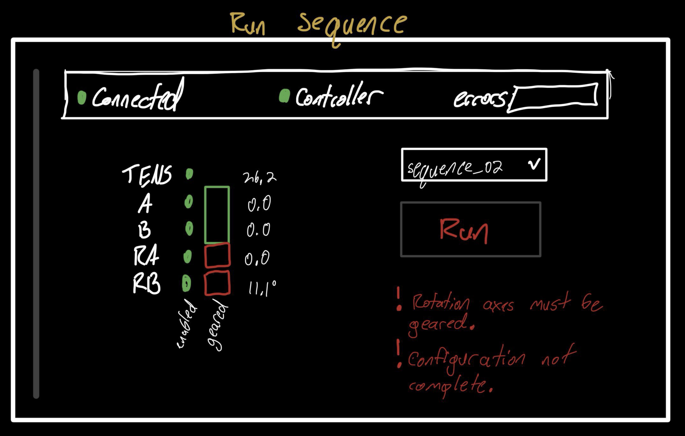

# Proposal: Graphical User Interface for the RAMS4 Load Frame

---

## Summary

The current operational workflow for the RAMS4 load frame is hampered by a steep learning curve, necessitating significant domain-specific knowledge to navigate command-line interfaces, Python scripts, and manual configuration of JSON/text parameters. This complexity mandates either rigorous user training or direct supervision by CHESS personnel, effectively limiting research throughput and system accessibility. This proposal details the development of a comprehensive graphical user interface (GUI) designed to abstract the underlying Python API layer and configuration management systems. By streamlining experiment setup and reducing the potential for configuration-related errors, this proposed interface will significantly lower the barrier to entry while maintaining the flexibility required for advanced experimentation.


## Current User Workflow & Existing Interfaces

### 1. Building & Configuring Tests

#### 1.1.
Sections 1.1.X must be configured before script_setup_RAMS.py is run.

#### 1.1.1. Controller Config: `RAMS_CHESS.json`
The RAMS controller JSON configures the lower level mappings for the axes and I/O.

```json
{
  "system_name": "RAMSIV_CHESS",
  "host": "172.30.3.18",
  "axis_count": 5,
  "task_count": 4,
  "axis": [
    {"id": 0, "name": "RT", "units": "deg", "max_velocity": 0.45, "max_acceleration": 0.5},
    {"id": 1, "name": "RB", "units": "deg", "max_velocity": 0.45, "max_acceleration": 0.5},
    {"id": 2, "name": "TEN", "units": "deg", "max_velocity": 0.45, "max_acceleration": 0.5},
    {"id": 3, "name": "A", "units": "deg", "max_velocity": 0.45, "max_acceleration": 0.5},
    {"id": 4, "name": "B", "units": "deg", "max_velocity": 0.45, "max_acceleration": 0.5}
  ],
  "input_signals": [
    {"name": "loadA", "units": "N", "scale": 1100, "offset": -0.123, "axis": 0, "channel": 0},
    {"name": "loadB", "axis": 1, "channel": 1},
    {"name": "torque", "axis": 2, "channel": 0}
  ]
}
```

**User Configure:**
- Input Signals?
- HOST
- System Name?
- Axis? 

**Admin Configure:**
- Entire File


#### 1.1.2. Data Acquisition Config: `daq_config.json`
Configure the DAQ sampling parameters, modes, and file naming.

```json
{
"sample_pts": 1000,
"frequency_kHz": 1,
"rglobal": [],
"iglobal": [0],
"output_directory": "./",

"handlers": [
  {
  "mode": "peak-valley",
  "filename": "peak_valley_001",
  "signal":{"axis": 3, "item": "PositionFeedback", "prominence": 0.005},
  "verbose": {"axis": [0,0,0,1,0], "IO": 0, "system": 0, "task": -1}
  },

  {
  "mode": "time-series",
  "filename": "time_series_001",
  "frequency": 500,
  "cycles": [[1,10],15,[20,100,10],2005],
  "verbose": {"axis": 0, "IO": 0, "system": 0, "task": -1}
  }
]
}
```

**User Configure:**
- Sample Points
- Frequency ("global")
- Handlers

**Admin Configure:**
- integer global
- real global


##### 1.2. Main Mechanical Workflow Config: `mech_workflow_config.json`
This JSON file links the directories and other config files needed to run a test, 
along with the experiment and file naming schemes, and the signal aliases.

```json
{
    "mech_test_array": "_take_debug.txt",
    "newsample": "align-0312-1",

    "xray_array": "ff_data_array.txt",
    "dic_position": "_dic_position.json",
    "require_spec_enable": false,

    "rams_config": "./examples/files/RAMS_CHESS.json",
    "rams_daq_config": "./examples/files/daq_config.json",
    "rams_required_axis_enabled": ["RT", "RB", "A", "B"],

    "user_id": "shade-4133-d",
    "cycle": "2026-1",

    "sample_directory": "/nfs/chess/aux/cycles/$cycle$/id1a3/$user_id$/$newsample$/",
    "user_directory": "/nfs/chess/aux/cycles/$cycle$/id1a3/$user_id$/holding_bay/",

    "spec_host": "id1a3.classe.cornell.edu:spec",
    "signal_aliases": {
        "load": "LoadA",
        "strain": "Strain",
        "spectolf": "SpecToLF",
        "lftospec": "LFToSpec"
    }
}

```

**User Configure:** 
- `mech_test_array`
- `newsample`
- `xray_array`
- `dic_position`
- `rams_required_axis_enabled` 
- `user_id`
- `cycle`
- `spec_host`

**Admin Configure:**
- Same as user
- require_spec_enable ?
- file paths


#### 1.3. Mechanical Test Sequence: `test_sequence.txt`
The core file that defines the test sequence, where lines are chronologically executed 
and each line contains space-delimited key-value pairs for commands/paramters.

Very Basic Example Sequence:
```text
ramp, axis=TEN, control=disp, mode=abs, target=-20, velocity=0.2
ramp, axis=TEN, control=disp, mode=abs, target=0, velocity=0.2
ramp, axis=TEN, control=disp, mode=abs, target=-20, velocity=0.2
```

**To Configure:**
- The entire test sequence file must be configured for each test.


#### 1.4. X-ray Scan Table: `ff_array.txt`
A space-delimited text file that defines the x-ray scan parameters.

5 Layers with Varying Positions Example:
```text
# ramsx  ramsz  ome_start  ome_stop  num_points  ctime  beam_height  beam_width  atten
0.0      0.0    -180.0     180.0     3600        0.1    0.05         0.5         0.5
0.0 1.0 -180.0 180.0 3600 0.1 0.05 0.5 0.5
0.0 2.0 -180.0 180.0 3600 0.1 0.05 0.5 0.5
0.0 3.0 -180.0 180.0 3600 0.1 0.05 0.5 0.5
0.0 4.0 -180.0 180.0 3600 0.1 0.05 0.5 0.5
```

**To Configure:**
- An array must be configured for each x-ray scan.


#### 1.5. DIC Position Config: `dic_position.json`
The x, z, $\omega$ of the DIC.

```json
{
  "ramsx": 0.0,
  "ramsz": -4.0,
  "omega": 36.0,
  "info": "Standard DIC hutch setup"
}
```


#### 1.6. DIC Parameters Table?: `dic_array.txt`
A space-delimited text file that configures a DIC scan.

```text
# ramsx  ramsz  ome   num_points  ctime  beam_height  beam_width  atten
0.0     -4.0   36.0  5           1.5    0.0          0.0         0.0
0.0     -4.0   90.0  5           1.5    0.0          0.0         0.0
```

**To Configure:**
- An array must be configured for each DIC scan. 

**Note:**
- For now the beam information must be included in the DIC array?


### 2. Hardware Initialization & Manual Configuration
Before performing any tests, the user must first initialize the system and load 
in a physical sample to the load frame. Maintenance or similar tasks will also require
manual interface of the load frame's controllers.

There is already a well-organized CLI interface for all the necessary manual control points,
all of which need to be exposed in the GUI. `1.1.X` must be configured before this
section is executed.

- **zero_offset** <signal_name>:           Perform zero offset for the given signal name. 
- **stat:**                                Display current status of the RAMS controller. 
- **gear** \[rotation|fatigue] \[on|off]:    Gear or ungear fatigue|rotation axis. 
- **mvabs** <axis> <position> \[dtime]:     Absolute move of specified axis. 
- **mvinc** <axis> <distance> \[dtime]:     Incremental move of specified axis. 
- **enable** <axis>:                       Enable specified axis. 
- **disable** <axis>:                      Disable specified axis. 
- **daq_run** <duration>:                  Run DAQ for specified duration in seconds. 
- **home** <axis> \[--no-prompt] \[--force]: Home specified axis.


# Interface Design & Implementation

## Login Screen
Upon launching the application, a login screen will require a user ID.

- User ID: text

### API Mappings

#### /api/start POST
This endpoint solely exists to validate the user ID, ensuring to the user that
they are logged in, or if they want to create a new user. **The frontend will
store the user ID, which will be used in the header in every subsequent API request.**

```json
{ user_id: <User ID (string)> }
```

After a successful login, the system will complete an initialization. Depending
on if the user is returning or new, the following steps will be taken:

#### New Users
- Creates the new user ID directory.
- Copies all necessary default files to the user ID directory.
  - ex. `settings.json` `default_config.json` etc.
  - This step can also just be reused from the _returning user's_ steps
- Follow _returning user's_ steps...

#### Returning Users
- Checks the user ID directory for required existing files.
  - Missing files will log an error and subsequently copy the default file as a replacement.
- Gets all the latest user files and populates the frontend with the data.
- Establishes a websocket connection to the backend.

---

## Home View / Menu Selection

#### Status Bar
Display quick status information about RAMS4. 
- Connected to RAMS (polled from websocket)
- Controller status (red, yellow, green) (polled from websocket)
- Error messages

#### Menus
Same menu options as on sidebar.
- Sequence Builder
- Run Sequence
- Manual Control
- Configure
- View Data
- Settings

---

## Configure View
This view will be the area for adjusting and configuring essential experiment settings.
These settings are not necessarily changed every test, but they will be commonly used between
users, tests, or experiments. More obscure or advanced configurations will be located in 
the app settings.

Since there are a lot of fields that the user will interact with, the _configure_ view will be
split into tab views. Below is a list of the tabs and their fields.

Users will configure the DIC and X-ray arrays by creating different profiles in the _configure_ view. These 
profiles will appear in certain dropdown menus in the _Sequence Builder_. This allows
for resuablable profiles and the ability to add or edit profiles at any time.

Each configuration will be saved to the user's ID. A dropdown menu will be
displayed outside the tab view so the user knows which configuration they
are editing, and so the user can easily switch between configurations. When a user
switches between configuration or leaves the _configure_ view, the configuration
will be saved automatically.

#### General config
- cycle: text
- sample name: text
- Required Axes: checkboxes

#### DAQ config
- hardware/master frequency: dropdown \[1, 5, 10, 20] (verify?)
- Sample points: number
- Handler Profile Builder:
  - mode
    - Depending on the mode, different fields will populate.

#### DIC config
- Trigger Mode: \[soft, hard]
- position: \[x, z, $\omega$]  (position might have to live in the profile) ??
- DIC Profile Builder
  - number of points: number
  - ctime: number

#### X-ray config
- X-ray Profile Builder
  - x: number
  - z: number
  - $\omega_0$: number
  - $\omega_f$: number
  - exposure: number
  - beam height: number
  - beam width: number
  - attenuation: number

### API Mappings

#### /api/config POST
When the user leaves the current configuration, this call will save the
configuration to a JSON file in the user's ID directory. The POST request
will also trigger the live/current backend files to be updated to the new
configuration. 

Query Parameters:
- `config_name`: <(string)>

```json
{
  "cycle": <(number)>,
  "sample_name": <(string)>,
  "required_axes": ["RT", "RB", "A", "B"],
  "master_frequency": <(number)>,
  "sample_points": <(number)>,
  "handler_profiles": [
    {
      "mode": "peak-valley",
      "filename": "peak_valley_001",
      "signal":{"axis": 3, "item": "PositionFeedback", "prominence": 0.005},
      "verbose": {"axis": [0,0,0,1,0], "IO": 0, "system": 0, "task": -1}
    },
    ...
  ],
  "dic_trigger_mode": <"soft" | "hard">,
  "dic_profilse": [
    {
      "x": <(number)>,
      "z": <(number)>,
      "omega": <(number)>,
      "num_points": <(number)>,
      "ctime": <(number)>,
      "beam_height": <(number)>,
      "beam_width": <(number)>,
      "atten": <(number)>
    },
    ...
  ],
  xray_profiles: [
    {
      "x": <(number)>,
      "z": <(number)>,
      "ome_start": <(number)>,
      "ome_stop": <(number)>,
      "num_points": <(number)>,
      "ctime": <(number)>,
      "beam_height": <(number)>,
      "beam_width": <(number)>,
      "atten": <(number)>
    },
    ...
  ]
}
```

#### /api/config GET
The GET request will return the requested configuration from the user's ID
directory. This request will not trigger any live files to be updated.

Query Parameters:
- `config_name`: <(string)>

---

## Settings Menu
All remaining configurations will be kept in the settings. Similar to the _configure_ view,
the settings menu will be split into tabs.

Similar to the _configurations_, a settings file will be saved to the user's ID directory.
However, only a single settings file will be saved and continually updated
as the user makes changes. There will be a _Rest to Defaults_ button that resets
the settings file to the default values.

#### General 
- spec Host: text
- require spec enable: toggle
- WebSocket Poll Frequency: number

#### RAMS
- System name ??
- hostname: text
- axis count: number
- task count: number
- for all axes:
  - max velocity: number
  - max acceleration: number
- input signals ??
  - channel??

#### DAQ
- ~~real global~~
- ~~integer global~~
  - Edit these manually in files
- Output Path: text

#### ~~DIC~~
- future addition


### API Mappings

#### /api/settings POST
This endpoint will update the user's settings file.

```json
{
  "spec_host": <(string)>,
  "require_spec_enable": <(bool)>,
  "system_name": <(string)>,
  "hostname": <(string)>,
  "axis_count": <(number)>,
  "task_count": <(number)>,
  "axis": 
          [
            {"name": "RT", "max_velocity": <(number)>, "max_acceleration": <(number)>},
            {"name": "RB", "max_velocity": <(number)>, "max_acceleration": <(number)>},
            {"name": "TEN", "max_velocity": <(number)>, "max_acceleration": <(number)>},
            {"name": "A", "max_velocity": <(number)>, "max_acceleration": <(number)>},
            {"name": "B",  "max_velocity": <(number)>, "max_acceleration": <(number)>}
          ],
  "input_signals": 
          [
            {"name": "loadA", "scale": <(number)>, "offset": <(number)>, "channel": <(number)>},
            {"name": "loadB", "channel": <(number)>},
            {"name": "torque", "channel": <(number)>}
          ],
  "output_path": <(string)>
}
```

#### /api/settings GET
This endpoint will return the user's settings file.

#### /api/settings/reset POST
This endpoint will reset the user's settings file to the default values.


## Sequence Builder View
The sequence builder is where tests can be created and edited. A test is a sequence of
commands that visually represented by lines of cards. At any point the user can
move, deleted, or add a new card. Adding a new card will create a new line with a
blank dropdown. The user can then select a command from the dropdown which will
populate the new card with the command's parameters and optional parameters. There
should also be a functionality to repeat blocks of cards, which is a common
user interface pattern. Users should be allowed to import their own custom
commands (see `CAN1, CAN2, CAN3` for examples)—likely just as raw python files
that can jsut be pointed to. This feature would require a more advanced user to
understand how to write their own python command script.

Sequences should be able to be saved, imported, and possibly exported. There could
be a dropdown menu to select from previously built sequences. Alternatively,
users could just use the import functionality to import a previously saved sequence.

| Command | Description | Parameters |
| :--- | :--- | :--- |
| **`RAMP`** | Linear loading | **Axis:** Text input<br>**Control:** Dropdown (`load`, `disp`, `strain`)<br>**Mode:** Dropdown (`absolute`, `incremental`)<br>**Target:** Number input<br>**Velocity:** Number input (optional)<br>**Max Disp:** Number input (optional)<br>**DIC Toggles:** Checkboxes (`dic` (optional), `skip_dic_pos` (optional)) |
| **`DWELL`** | Hold at load | **Axis:** Text input<br>**Control:** Dropdown (`load`, `strain`)<br>**Target:** Number input<br>**Velocity:** Number input<br>**Time:** Number input (optional)<br>**ImgMode:** Dropdown (`ff`, `dic`, etc.) (optional)<br>**Xray Array:** Profile Dropdown (optional) |
| **`TAKE`** | Take a stationary image scan | **Mode:** Dropdown (`ff`, `nf`, `tomo`, `mapscan`, `dic`)<br>**Data Array:** Profile Dropdown (optional)<br>**Stills Array:** Profile Dropdown (optional)<br>**Pause DAQ:** Checkbox (`pause_ts_daq`) (optional) |
| **`TAKEWHILE`** | Take images *during* movement | **ImgMode:** Dropdown (`ff`, `dic`, etc.)<br>**MechMode:** Dropdown (`ramp`, `cycle`, `dwell`) - All fields from selected MechMode (optional)<br>**Xray Array:** Profile Dropdown (optional)<br>**Stills Array:** Profile Dropdown (optional) |
| **`CYCLE`** | Cyclic fatigue loading | **Axis:** Text input<br>**Control:** Dropdown (`load`, `disp`, `strain`)<br>**Mode:** Dropdown (`absolute`, `incremental`)<br>**End 1:** Number input<br>**End 2:** Number input<br>**Freq:** Number input (Hz)<br>**Num Cycles:** Number input (optional)<br>**Amp Scale:** Number input (optional) |
| **`SET`** | Update system state mid-test | **Break Load:** Number input (optional)<br>**Xray Array:** Profile Dropdown (optional)<br>**DIC State:** Dropdown (`on`, `off`) (optional)<br>**DIC Trigger:** Dropdown (`hard`, `soft`) (optional) |
---

## Telemetry / Data View
The data view will display metrics and plots from DAQ data, which can be viewed
in real-time or from a saved experiment. The same status display from _Manual
Control_ (axis positions, gearing, warnings, etc.) will be displayed during
an active/live test. 

A few plots (some possibly with shared axes) can be displayed from the `h5` files.
The UI could provide checkboxes to toggle which plots are visible on the one
or multiple plot axes.
- load A (N)
- load B (N)
- torque (N-m)
- strain (does this work?)
- displacement (mm)
- rotation (degrees)

Additionally, vertical lines could be plotted where parts of the sequences begin.

---

## Run sequence View
Before a test is started, there should be important information displayed:
- Name of current sequence (or selected sequence from dropdown)
- status of RAMS4 (same status items from the _Manual Control_ view)

After a "_start_" button is pressed, live telemetry will be displayed (likely the
same from the telemetry/data view), along with important logs/warnings/errors from the backend.
The current sequence step will be shown as it executes. A status indicator will
be displayed at the top of the screen if the user leaves the view.

---

## Manual Control View
RAMS4 can be controlled directly from the GUI. The following table lists the 
components that will control the system.

| Description         | CLI Command          | UI Component          | Notes                                     |
|:--------------------|:---------------------|:----------------------|:------------------------------------------|
| Jog Axis up/down    | `mvinc`              | stepper               | Jogs selected axis.                       |
| Position Axis       | `mvabs`              | slider + number field | Moves selected axis to specific position. |
| Enable/Disable Axis | `enable` / `disable` | toggle                | Enables/disables selected axis.           |
| Home Axis           | `home`               | button                | Homes selected axis.                      |
| Gear Fatigue        | `gear fatigue`       | toggle                | Gears/un-gears fatigue axis.              |
| Gear Rotation       | `gear rotation`      | toggle                | Gears/un-gears rotation axis.             |
| Zero                | `zero_offset`        | button                | Perform zero offset for all.              |
| DAQ Run             | `daq_run`            | button                | Runs DAQ test for all.                    |


Alongside the controls, the following correlated values will be displayed adjacent to the controls.
The following status items will be streamed over websockets
(more information can be found in websockets section below):
- axis positions: number 
- axes enabled: status indicators 
  - websockets —> because controller can change if there is an error
- fatigue gear: status indicator 
  - websockets —> because controller can change it automatically
- rotation gear: status indicator 
  - websockets —> because controller can change it automatically
- axes homed: status indicators 
  - websockets —> because homing takes a long time
- Controller locked: red, yellow, green indicator 
  - 0: not configured, 1: configured, 2: active
- Logs/errors: text output
  - responses/websockets

### API Mappings

#### /api/control POST
The JSON data in this request will reflect the which control was interfaced
with in the frontend.

```json
{"cmd": mvinc, "value": <1 | -1>, "axis": <(string)>} 
```

```json
{"cmd": mvabs, "value": <(number)>, "axis": <(string)>} 
```

```json
{"cmd": <enable | disable>, "value": <axis_name (string)>} 
```

```json
{"cmd": home, "value": <axis_name (string)>} 
```

```json
{"cmd": gear fatigue, "value": <true | false>} 
```

```json
{"cmd": gear rotation, "value": <true | false>} 
```

```json
{"cmd": zero_offset} 
```

```json
{"cmd": daq_run} 
```

---

## Drafted Mock-up of GUI








## Technology

### WebSockets
A WebSocket is opened upon the user logging in, which will handle real-time
communication from the backend to the frontend. Internally, a loop will check
all the following conditions (if they exist) and send a message at the set 
frequency.

```json
{
  "positions": {
    "RT": <(number)>,
    "RB": <(number)>,
    "TEN": <(number)>,
    "A": <(number)>,
    "B": <(number)>
  },
  "status": {
    "is_geared_fatigue": <(bool)>,
    "is_geared_rotation": <(bool)>,
    "is_moving": <(bool)>,
    "controller_locked": <0 | 1 | 2>
  },
  "daq_headers": <list of strings>,
  "daq_data": <list of lists of numbers>,
  "messages": <important logs/warnings/errors (list of strings)>
}
```

#### DAQ Headers

The following table lists the headers generatored in the `h5` file during DAQ.

TODO verify this is correct!

| DAQ Header            | Physical Parameter | Default Unit  | Source Axis / Index | Description & Common Usage |
|:----------------------| :--- |:-------------:| :---: | :--- |
| **`GlobalInteger_0`** | Cycle / Segment Count |     Count     | `iglobal[0]` | Tracks test progress. Used as the X-axis for plotting cyclic statistics (e.g., peak load vs. cycle count). |
| **`PosFbk_0`**        | Rotation Top Position |    degrees    | `RT` (Axis 0) | Angular position of the upper rotational stage. |
| **`PosFbk_1`**        | Rotation Bottom Position |    degrees    | `RB` (Axis 1) | Angular position of the lower rotational stage. |
| **`PosFbk_2`**        | Tension Axis Position |      mm       | `TEN` (Axis 2) | Physical displacement of the main load actuator. Used as the X-axis for stress-strain plotting. |
| **`PosFbk_3`**        | Fatigue Axis A Position |      mm       | `A` (Axis 3) | Linear actuator position for Fatigue Axis A. |
| **`PosFbk_4`**        | Fatigue Axis B Position |      mm       | `B` (Axis 4) | Linear actuator position for Fatigue Axis B. |
| **`AI0_0`**           | Analog Input 0 (Load) |  Newtons (N)  | Axis 0, Chan 0 | The main force reading from Load Cell A. Used as the Y-axis for stress-strain plotting. |
| **`AI1_0`**           | Analog Input 1 (Strain) | $\mu\epsilon$ | Axis 0, Chan 1 | Extensometer or strain gauge signal measuring sample deformation. |
| **`AI0_1`**           | Analog Input 2 (Load B) |    Newtons    | Axis 1, Chan 0 | Secondary load cell reading (used in dual-load cell configurations). |
| **`AI1_1`**           | Analog Input 3 (Torque) |      N-m      | Axis 1, Chan 1 | Torsional load cell signal measuring torque on the sample. |
| **`DI_0`**            | Digital Input 0 | Binary (0/1)  | Axis 0, Port 0 | Camera trigger confirmation indicator. |
| **`DI_2`**            | Digital Input 2 | Binary (0/1)  | Axis 0, Port 2 | Hardware state flag verifying camera connection validity. |

Example JSON with data:
```json
{
  "daq_headers": [
    "GlobalInteger_0",
    "PosFbk_0",
    "PosFbk_1",
    "PosFbk_2",
    "PosFbk_3",
    "PosFbk_4",
    "AI0_0",
    "AI1_0",
    "AI0_1",
    "AI1_1",
    "DI_0",
    "DI_2"
  ],
  "daq_data": [
    [1, 45.00, 0.00, 10.512, 5.002, 5.001, 500.2, 120.5, 0.0, 12.4, 1, 1],
    [1, 45.15, 0.00, 10.515, 5.005, 4.998, 505.6, 122.1, 0.0, 12.6, 0, 1]
  ]
}
```

### Storage

#### User ID's
There will need to be a way to uniquely identify users for the convenience of the user and
organization of the data. Currently, user data is stored as `<last_name>-<cycle?>-<ordered_num/letter>`.
Since user ID's need to be unique but security is not a concern, the user ID could just be
the same as the user's CLASSE username.

#### User Data Storage (Server-side)
The application will store the default configurations for all the text/json files. When 
the user opens the application, the application will search for the user's data directory,
and if not found, a new one will be created. Similar to the current `HoldingBay` directory,
the user's data directory will contain a copy of all the necessary files above. Instead
of directly modifying the default files in the application, the application will point to
the user's data directory and use those files.

The user will also need access to the data directory for data analysis and external
visualizations. There will need to be an easily accessible data directory for each
user ID stored outside the application.

#### Caching (Client-side)
Since configuration may take extentive time to input, the application will cache the input
fields attached to the user's ID in the browser's local storage. Once the backend has successfully
received the data, the local storage will be cleared. When a user opens the application, 
the application will check if there is any data user that user's ID in the local storage,
populating the fields if found.

### Error Handling & Validation

#### Data Validation
All data received from the frontend will be assumed untrusted, and its contents
will be verified before being executed by the backend. If limits apply to 
certain values, they will be checked before being executed in the backend.

#### Logging & Error Handling
All errors that are caught by the backend will be returned to the frontend.
When necessary, warnings and important logs will also be sent to the frontend
in a `"messages"` field in the response.
When an error occurs, the operation is not executed nor partially executed.
All backend logs will continue to be stored in a log file per user ID.

---

## Technical Layout & High-Level Architecture
```text
Frontend Web App
- all GUI elements
```
```text
Translation Layer 
- REST API for communication with backend
- transposes request data into backend's txt/json formats
```
```text
Backend API
- existing codebase
```

### Draft File Structures:
```text
.
└── RAMS4 GUI/
    └── src/
        ├── App.tsx
        ├── main.tsx
        ├── assets/
        │   └── ...
        ├── components/
        │   └── ...
        ├── layout/
        │   └── ...
        ├── types/
        │   └── ...
        ├── features/
        │   ├── configuration
        │   ├── manualControl
        │   ├── SequenceBuilder
        │   └── ...
        └── api/
            ├── client
            └── ...
```
```text
.
└── api_gateway/
    ├── run.py
    ├── config.py
    └── src/
        ├── main.py
        ├── routes/
        │   ├── control.py
        │   ├── sequence_builder.py
        │   └── user_config.py
        ├── sockets/
        │   └── streamer.py
        ├── validation/
        │   ├── control_schemas.py
        │   ├── sequence_schemas.py
        │   └── user_config_schema.py
        ├── translation/
        │   ├── control_trans.py
        │   ├── sequence_trans.py
        │   └── user_config_trans.py
        ├── rams/
        │   ├── manager.py
        │   ├── file_handler.py
        │   └── ...
        └── ...
```

### Infrastructure

#### Frontend Web App
- React
- Zustand
- Tailwind CSS
- Typescript
- NPM
- Vite

#### Translation Layer / API Gateway
- Python
- FastAPI
  - FastAPI WebSockets
  - pydantic

#### Backend API
- Existing codebase

---

## Development Roadmap

### MVP


### Config

### Sequence Builder

### Data viewer / sequencer builder visualization situation
